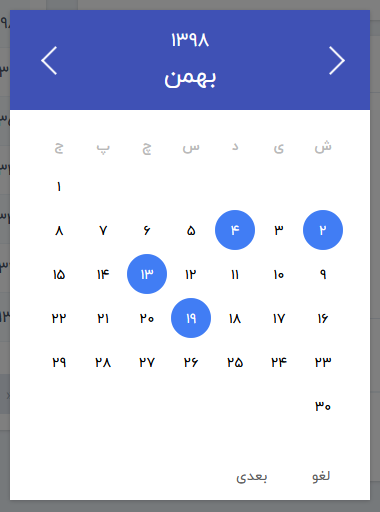
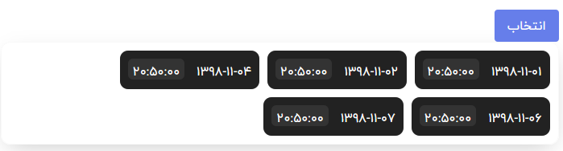

# vue-persian-datepicker
Persian calendar and datepicker component with material design for Vue.js

# Demo

The demo page is [HERE](https://hamidelectronic.github.io/vue-persian-datepicker/demo.html).




# Requirements

- [Vue.js](https://github.com/yyx990803/vue) `^2.0.0`
- [moment-jalaali](https://github.com/jalaali/moment-jalaali) `^0.9.1`

# Installation

## npm

```shell
$ npm install vue-persian-datepickers
```

# Usage

```html
<script>
import myDatepicker from 'vue-datepicker'

export default {
  data () {
    return {
      startTime: {
        time: ''
      },
      endtime: {
        time: ''
      }

      option: {
        type: 'day',
        week: ['Mo', 'Tu', 'We', 'Th', 'Fr', 'Sa', 'Su'],
        month: ['January', 'February', 'March', 'April', 'May', 'June', 'July', 'August', 'September', 'October', 'November', 'December'],
        format: 'YYYY-MM-DD',
        placeholder: 'when?',
        inputStyle: {
          'display': 'inline-block',
          'padding': '6px',
          'line-height': '22px',
          'font-size': '16px',
          'border': '2px solid #fff',
          'box-shadow': '0 1px 3px 0 rgba(0, 0, 0, 0.2)',
          'border-radius': '2px',
          'color': '#5F5F5F'
        },
        color: {
          header: '#ccc',
          headerText: '#f00'
        },
        buttons: {
          ok: 'Ok',
          cancel: 'Cancel',
          next: 'Next',
          select: 'Select'
        },
        overlayOpacity: 0.5, // 0.5 as default
        dismissible: true // as true as default
      },
      timeoption: {
        type: 'min',
        week: ['Mo', 'Tu', 'We', 'Th', 'Fr', 'Sa', 'Su'],
        month: ['January', 'February', 'March', 'April', 'May', 'June', 'July', 'August', 'September', 'October', 'November', 'December'],
        jWeek: ['ش', 'ی', 'د', 'س', 'چ', 'پ', 'ج'],
        jMonth: ['فروردین', 'اردیبهشت', 'خرداد', 'تیر', 'مرداد', 'شهریور', 'مهر', 'آبان', 'آذر', 'دی', 'بهمن', 'اسفند'],
        format: 'YYYY-MM-DD HH:mm:ss',
        jalaali: false,
        fontFamily: 'Tahoma'
      },
      multiOption: {
        type: 'multi-day',
        week: ['Mo', 'Tu', 'We', 'Th', 'Fr', 'Sa', 'Su'],
        month: ['January', 'February', 'March', 'April', 'May', 'June', 'July', 'August', 'September', 'October', 'November', 'December'],
        jWeek: ['ش', 'ی', 'د', 'س', 'چ', 'پ', 'ج'],
        jMonth: ['فروردین', 'اردیبهشت', 'خرداد', 'تیر', 'مرداد', 'شهریور', 'مهر', 'آبان', 'آذر', 'دی', 'بهمن', 'اسفند'],
        format:"YYYY-MM-DD HH:mm:ss",
        jalaali: false,
        fontFamily: 'Tahoma'
      },
      limit: [{
        type: 'weekday',
        available: [1, 2, 3, 4, 5]
      },
      {
        type: 'fromto',
        from: '2016-02-01',
        to: '2016-02-20'
      }]
    }
  },
  components: {
    'date-picker': myDatepicker
  }
}
</script>
<template>
  <div class="card">
    <div class="row">
      <date-picker :date="startTime" :option="option" :limit="limit"></date-picker>
    </div>
  </div>
</template>
```

# API

 - Option 

 * type

```
  type: 'day' // 'min', 'multi-day'

```

 * format

```
format: 'YYYY-MM-DD HH:mm'
```

 * jalaali

```
jalaali: false //true for jalaali calendar
```

 * fontFamily

```
fontFamily: 'Tahoma'
```


 * placeholder

```
placeholder: 'when?'
```

 * week

```
 week: ['Mo', 'Tu', 'We', 'Th', 'Fr', 'Sa', 'Su']
```

 * month

```
  month: ['January', 'February', 'March', 'April', 'May', 'June', 'July', 'August','September', 'October', 'November', 'December']
```


 * jWeek

```
 jWeek: ['ش', 'ی', 'د', 'س', 'چ', 'پ', 'ج']
```

 * jMonth

```
  jMonth: ['فروردین', 'اردیبهشت', 'خرداد', 'تیر', 'مرداد', 'شهریور', 'مهر', 'آبان', 'آذر', 'دی', 'بهمن', 'اسفند']
```


* wrapperClass

```
wrapperClass: ''
```

* inputClass

```
inputClass: ''
```
* inputStyle

```
inputStyle: {
  'display': 'inline-block',
  'padding': '6px',
  'line-height': '22px',
  'font-size': '16px',
  'border': '2px solid #fff',
  'box-shadow': '0 1px 3px 0 rgba(0, 0, 0, 0.2)',
  'border-radius': '2px',
  'color': '#5F5F5F'
}
```

 * color

```
  color: {
    header: '#ccc',
    headerText: '#f00'
  }
```


 * buttons

```
buttons: {
  ok: 'OK',
  cancel: 'Cancel',
  next: 'Next',
  select: 'Select'
}
```

 * animate

```
  overlayOpacity: 0.5, // 0.5 as default
  dismissible: true // as true as default
```


 - limit

  * from sometime to sometime(when from/to is empty, days before/after end/start time will be available)

```javascript

limit: {
  type:'fromto',
  from:'2016-01-10',
  to:'2016-01-30'
}

```
 * weekdays

```javascript

limit:{
  type: 'weekday',
  available: [1, 2, 3, 4, 5] 
}

```

### prop

```javascript
date: {
  time: '' // string
}
```

```html

<date-picker :date="date" :limit="limit"></date-picker>

```


# License

[The MIT License](http://opensource.org/licenses/MIT)

